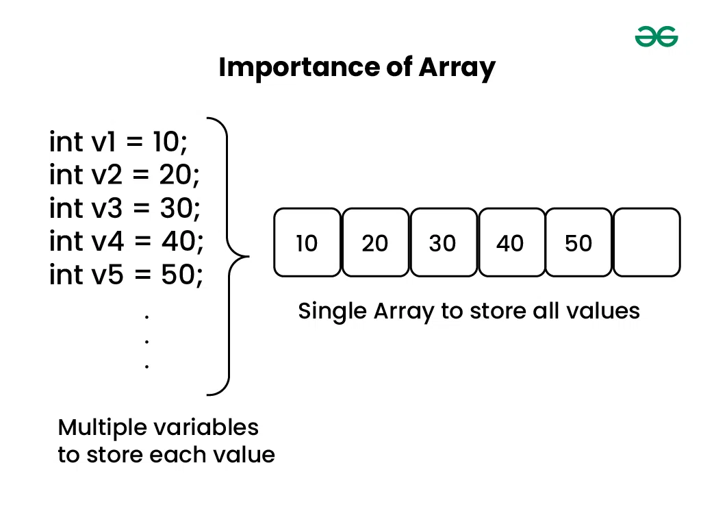

### Linear DataStructure : Array

- Stores a collection of elements of the same data type.
- Elements are allocated contiguous memory, allowing for *constant-time access*.
- Each element has a unique index number.

Based on above image, we can understand that array is to represent many instance in one variable. 

#### Types of Arrays on the basis of Dimensions
1. 1-D Array: Elements are stored one after another.
2. Multi-Dimensional Array: Has more than one dimension. We can use multidimensional array to store complex data in the form of tables
    Like: 2-D arrays, 3-D arrays, 4-D arrays and so on.

#### Operations on Array
1. Array Traversal:
2. Insertion in Array
3. Deletion in Array
4. Searching in Array

Refer "array_operations.py" file

